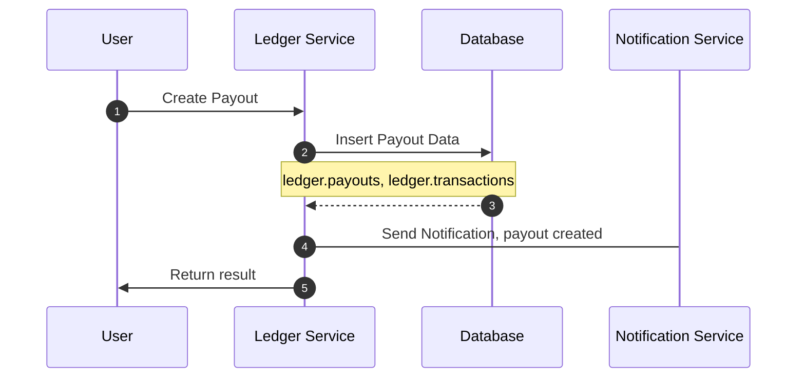
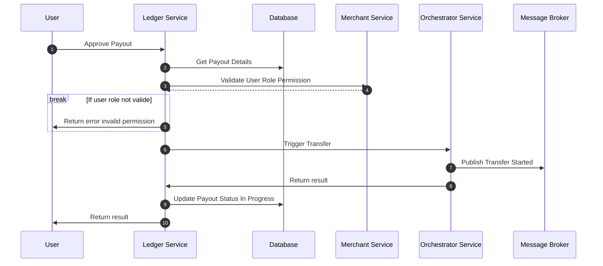
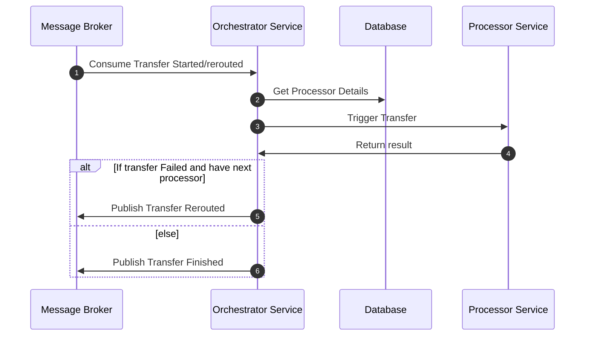
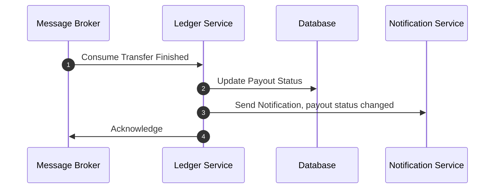

# Payout System Design

## Payout Processing Flow

### Create Payout

```mermaid
sequenceDiagram
	autonumber
	participant US as User
	participant LD as Ledger Service
	Participant DB as Database
	participant NT as Notification Service

	US ->> LD: Create Payout
	LD ->> DB: Insert Payout Data
	note over LD,DB: ledger.payouts, ledger.transactions
	DB -->> LD: 
	LD -> NT: Send Notification, payout created
	LD ->> US: Return result
```

### Approval Payout

```mermaid
sequenceDiagram
	autonumber
	participant US as User
	participant LD as Ledger Service
	participant DB as Database
	participant MC as Merchant Service
	participant OC as Orchestrator Service
	participant MB as Message Broker

	US ->> LD: Approve Payout
	LD ->> DB: Get Payout Details
	LD ->> MC: Validate User Role Permission
	MC -->> LD: 
	break If user role not valide
	  LD ->> US: Return error invalid permission
	end
	LD ->> OC: Trigger Transfer
	OC ->> MB: Publish Transfer Started
	OC ->> LD: Return result
	LD ->> DB: Update Payout Status In Progress
	LD ->> US: Return result
```

### Trigger Transfer/Reroute

```mermaid
sequenceDiagram
  autonumber
	participant MB as Message Broker
	participant OC as Orchestrator Service
	participant DB as Database
	participant PC as Processor Service

	MB ->> OC: Consume Transfer Started/rerouted
	OC ->> DB: Get Processor Details
	OC ->> PC: Trigger Transfer
	PC ->> OC: Return result
	alt If transfer Failed and have next processor
	  OC ->> MB: Publish Transfer Rerouted
	else else
		OC ->> MB: Publish Transfer Finished
	end
```

### Transfer Finished

```mermaid
sequenceDiagram
	autonumber
	participant MB as Message Broker	
	participant LD as Ledger Service
	participant DB as Database
	participant NT as Notification Service

	MB ->> LD: Consume Transfer Finished
	LD ->> DB: Update Payout Status
	LD ->> NT: Send Notification, payout status changed
	LD ->> MB: Acknowledge
```
